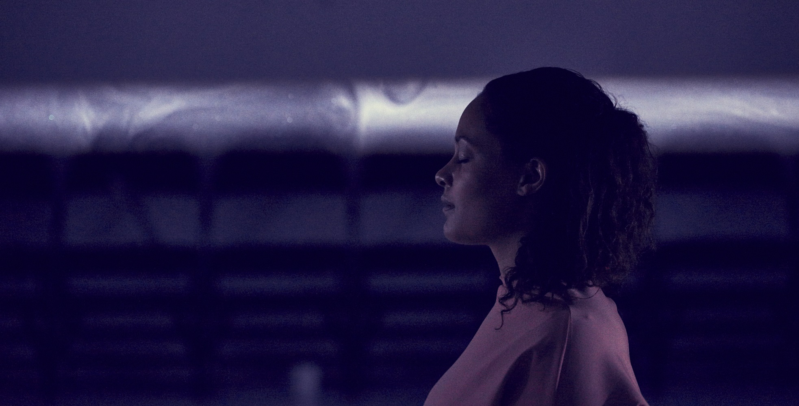
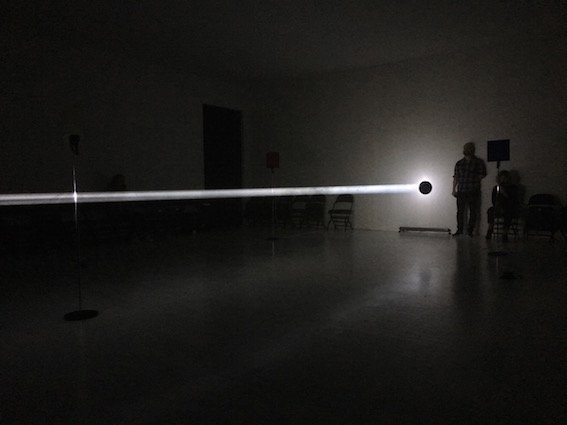
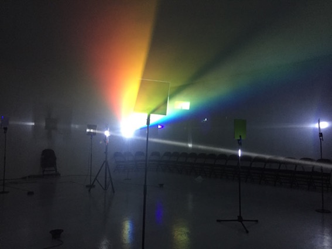

**DOUBLE FEATURE**. 
**The Echo of The Subject**  
*(Hölderlin/China Mieville/Anders Paulin/Bojana Cvejić)*  
Nationaltheatret, Oslo (Sep-Oct 2017)

*“Dreams of height give sustenance to our instinct of verticality, an instinct that is repressed by the needs of everyday, prosaically horizontal life. Vertically – tending reverie is the most liberating of all. There is no surer way of dreaming well than dreaming in another world. But is not the world above the most decisive of other worlds? May dreams develop in which the above forgets and suppresses the below? Living at the zenith of the upright object, gathering reveries of verticality, we experience a transcendence of being.”*  
(Gaston Bachelard, *La Flamme d’une chandelle*)

It begins with a search, as if all endeavors of subjectivity entail investigation and construction from traces and ruins. A poet seeks to found a kingdom of art and wonders what it would mean to dwell poetically. Gazing at the thundering sky, or recasting the old Greek tragic myths, the poet listens to the echo of the gods that are absent. Where is home? And no one knows…  
A detective investigates a criminal case of a dead body. The path of his search unfolds a geography of carefully guarded differences between being a citizen of this city and that city.  
Imagine a city, just like yours, and a house, just like the one you are living in, and a person, just like you in that house, who is supposed to be different but turns out very similar, almost coinciding with you.  

Looking for the self-same, one finds minute differences, resemblances that disturb me by slight distance posited between myself and my mirror-image, a brief delay between my voice as I hear it in my head and the recording in which I hear myself as another, a distorted echo. It is impossible to coincide with oneself because at the origin, there is no identity, there is differentiation, uncanniness and estrangement. One is different in itself. The psychoanalyst, Jacques Lacan, describes the constitutive experience of the so-called mirror stage (a six-month old infant sees itself in the mirror for the first time): the subject first sees itself in an other, more advanced and more perfect than it, an Ego that is alien to it, an image that eludes the perception of totality. There begins a mimetic rivalry, attempts of mimetic identification.

In theater listening might mean freedom from participation, from speaking or doing any other kind of action in order to verify your activity as spectator. Listening, falling asleep, dreaming? The phenomenology of this freedom is in your ear that acts like a funnel, collects and swallows every word because this is mainly what there is. While the sense of vision is connoted with clarity, with the total grasp and control of space, the activity of listening entails temporalization and an attitude of reception. To be able to imagine, one must initially trust the words that draw them into a world, words environed by sounds and light that take you out of here-and-now.

Caesura acts as a point of interruption, a counter-rhythmic rupture as Hölderlin wrote of Greek tragedies when humans and gods meet briefly. What happens then is the “tragic transport” which “is essentially empty, and the most unbounded of all.” It is the moment where a succession of thoughts is halted, so that the thinking itself appears. Perhaps this is the thought of the spectator, who like the actor is thinking along the whole way.

*Bojana Cvejić*

